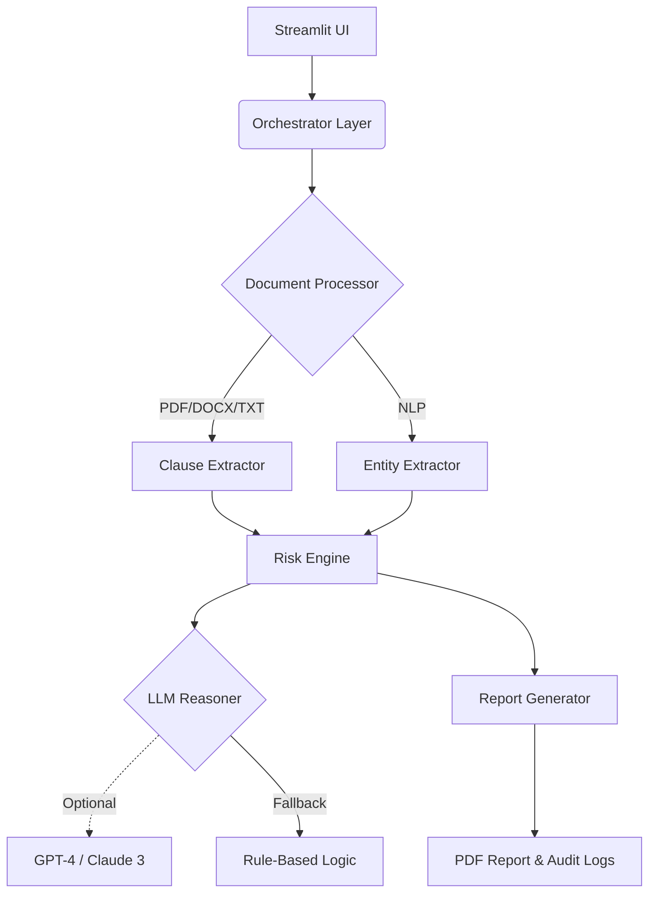

Here is a professional, structured, and visually appealing `README.md` for your GitHub repository. You can copy and paste this directly.

---

# ⚖️ GenAI-Powered Legal Contract Analysis Assistant (India)

**A production-grade GenAI legal assistant designed to help Indian Small and Medium Enterprises (SMEs) understand complex contracts, identify legal risks, and receive actionable, plain-language advice.**

> **Privacy-First & Offline-Safe:** Built with a "local-first" architecture. No external legal APIs are required. Full audit trails included.

---

## 🚀 Overview

Small businesses in India often sign contracts they don't fully understand due to language barriers and complex legalese. This tool bridges that gap. It ingests contracts (PDF, DOCX, TXT), analyzes them against Indian legal contexts, scores risks, and explains clauses in plain English or Hindi.

**Key Differentiator:** The system works **100% offline** using rule-based logic and NLP. It can optionally be supercharged with LLMs (Claude 3 / GPT-4) for deeper reasoning if API keys are provided.

---

## ✨ Key Features

### 📄 Contract Understanding

* **Format Support:** PDF (text-based), DOC/DOCX, and TXT.
* **Doc Types:** Employment Agreements, Vendor Contracts, Leases, Partnership Deeds, Service Contracts.
* **Granular Analysis:** Extracts and explains content clause-by-clause.

### ⚖️ Legal Risk Detection

* **Scoring:** Generates a Contract Risk Score (Low/Medium/High).
* **Red Flags:** Identifies penalty clauses, one-sided indemnities, unilateral termination, and strict lock-in periods.
* **Jurisdiction:** Flags arbitration and jurisdiction risks specific to Indian law.

### 🌐 Multilingual Intelligence (India-Centric)

* **Bilingual Support:** Native support for **Hindi** and **English**.
* **Hinglish:** Handles mixed-language contracts efficiently.
* **Normalization:** Preserves strict legal terms while simplifying the surrounding explanation.

### 🤖 GenAI Reasoning (Hybrid Architecture)

* **Rule-Based Core:** Works out-of-the-box without internet.
* **LLM Boost (Optional):** Plug in OpenAI or Anthropic keys for advanced reasoning and summarization.
* **Cost Control:** Caches responses to minimize API costs.

### 🧾 SME-Friendly Templates

* Access ready-to-use, balanced contract templates aligned with Indian law.
* Variable-driven customization for quick drafting.

---

## 🏗️ System Architecture

The application follows a modular architecture separating the UI, processing logic, and risk engines.



---

## 📂 Project Structure

```bash
├── streamlit_app.py          # Main UI entry point
├── orchestrator.py           # System coordinator connecting all modules
├── document_processor.py     # File ingestion (PDF/DOCX/TXT)
├── language_handler.py       # Hindi-English normalization & translation
├── contract_classifier.py    # Detects agreement type (e.g., Lease vs Vendor)
├── clause_extractor.py       # Regex & NLP based clause parsing
├── entity_extractor.py       # Extracts Parties, Dates, Amounts, IP terms
├── risk_engine.py            # Core logic for scoring and red-flagging
├── llm_reasoner.py           # Optional wrapper for Claude/GPT
├── template_engine.py        # Generates contracts from templates
├── pdf_report_generator.py   # Creates watermarked downloadable PDFs
├── audit_logger.py           # JSON-based security logging
├── templates/                # Folder containing .txt/.json contract templates
├── cache/                    # Local storage for API responses & vectors
├── requirements.txt          # Python dependencies
└── README.md                 # Documentation

```

---

## ⚙️ Installation & Setup

### Prerequisites

* Python 3.8 or higher
* Git

### 1. Clone the Repository

```bash
git clone https://github.com/your-username/legal-genai-assistant.git
cd legal-genai-assistant

```

### 2. Create a Virtual Environment (Recommended)

```bash
python -m venv venv
# Windows
venv\Scripts\activate
# Mac/Linux
source venv/bin/activate

```

### 3. Install Dependencies

```bash
pip install -r requirements.txt

```

### 4. Install NLP Models

The system uses SpaCy for entity recognition.

```bash
python -m spacy download en_core_web_sm

```

### 5. (Optional) Configure LLM Keys

If you want to use the GenAI features, export your keys. If skipped, the system uses rule-based logic.

**Mac/Linux:**

```bash
export OPENAI_API_KEY="sk-..."
export ANTHROPIC_API_KEY="sk-ant-..."

```

**Windows (PowerShell):**

```powershell
$env:OPENAI_API_KEY="sk-..."
$env:ANTHROPIC_API_KEY="sk-ant-..."

```

### 6. Run the Application

```bash
streamlit run streamlit_app.py

```

---

## 🧪 Supported Inputs

| Format | Supported | Notes |
| --- | --- | --- |
| **PDF (Text-Based)** | ✅ | Native digital PDFs work best. |
| **DOC / DOCX** | ✅ | Standard Word documents. |
| **TXT** | ✅ | Raw text files. |
| **Scanned PDF (Images)** | ❌ | OCR is currently out of scope. |

---

## 🔐 Security & Privacy

This tool is designed for sensitive legal data:

1. **Local Processing:** Files are processed in RAM and temporary local storage. They are **never** uploaded to a cloud database.
2. **Audit Trail:** Every analysis generates a JSON audit log recording the timestamp, file hash, and risk score (but not the file content) for accountability.
3. **No Training:** Your data is not used to train any models.

---

## 🔮 Roadmap

* [ ] Add OCR support (Tesseract) for scanned documents.
* [ ] Integration with DigiLocker (India).
* [ ] Voice-based Q&A for accessibility in rural India.

---

## 🤝 Contributing

Contributions are welcome! Please open an issue or submit a pull request.

## 📄 License

Distributed under the MIT License. See `LICENSE` for more information.
